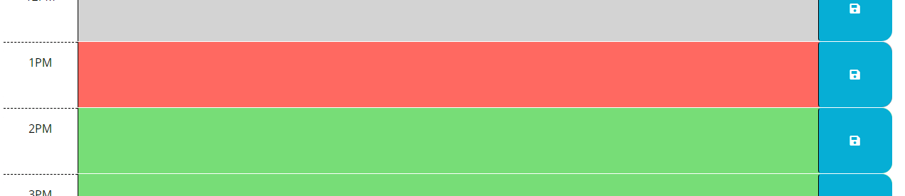

# Work-Day-Scheduler

## Description 
This is the Work-schedule planner. When you open the planner, the current day is displayed at the top of the calendar.

If you scroll down, there are timeblocks for your standard business hours that also diplays in different colors for past (grey), present (red) and future (green) time compares to your current hour.

If you click into a random timeblock, you can input any notes/events and you can use a save button in the right to save event in local storage. 
Once you save the events, the saved events persist when you refresh the page. 

If you open the app that are not with the business time (from 9am-6pm), it will display grey for all of the block. 

## Installation 
N/A

## Deployment Link

## License 
 Distributed under the MIT License. 